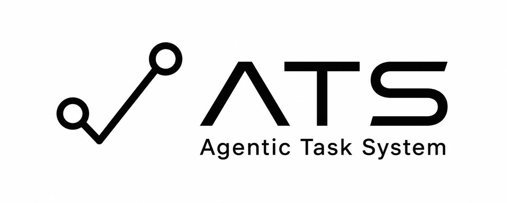
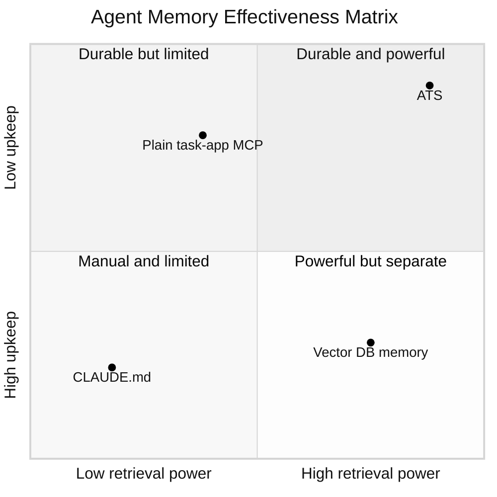
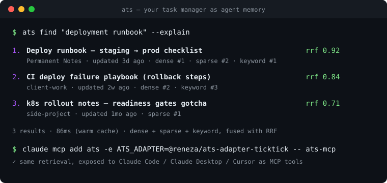
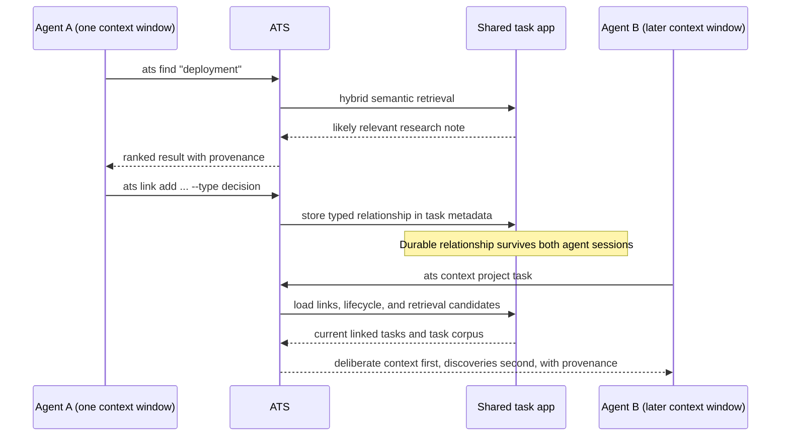

<p align="center">
  
</p>

<p align="center"><strong>Your task manager is the best agent memory you're not using.</strong></p>

<p align="center">
  <a href="https://www.npmjs.com/package/@reneza/ats-cli"></a>
  <a href="https://github.com/renezander030/agentic-task-system/actions/workflows/ci.yml"></a>
  <a href="LICENSE"></a>
  
</p>

`ats` is an **MCP server and CLI that gives your AI agent memory and execution context from the task manager you already use** — TickTick or an Obsidian vault. It combines adapter-aware retrieval fused by Reciprocal Rank Fusion (RRF) with portable intent, typed task relationships, lifecycle validity, scoped access decisions, context assembly, an action ledger, and bounded task-state events. TickTick can add dense search through local Qdrant + Ollama; file adapters work without either service. ATS works with Claude Code, Claude Desktop, Cursor, and any MCP client.



Most "agent memory" projects build a *new* store — a vector DB, a bespoke
framework — that drifts from reality the moment you stop feeding it. But you
already maintain a knowledge base by hand, every day: your task app. Years of
curated, prioritized, deduplicated context, pre-filtered by the most reliable
ranker there is — you.

ATS makes that context agent-native. **Adapter, not migration**: keep the app
you already live in (TickTick or an Obsidian vault today; Notion next) and give
your agent a fast, structured, two-way channel into it.

```bash
npm install -g @reneza/ats-cli @reneza/ats-adapter-ticktick
ats config use ticktick
ats auth login
ats find "deployment runbook"
```

<p align="center">
  
</p>

## Why this exists

Andrej Karpathy's [LLM Wiki](https://www.mindstudio.ai/blog/andrej-karpathy-llm-wiki-knowledge-base-claude-code) idea — keep notes as plain markdown an LLM can reason over — is right about the destination and wrong about the starting line. Almost nobody's knowledge lives in clean markdown; it lives in the task app they've used for years. ATS closes that gap with pluggable storage adapters, so you get an agent-queryable knowledge layer without re-homing a single note.

## How it compares

| Approach | Where memory lives | Upkeep | Retrieval |
| --- | --- | --- | --- |
| `CLAUDE.md` / memory files | markdown you re-edit by hand | manual, drifts | none — whole file injected every session |
| Vector-DB agent memory (mem0-style) | a new store only the agent sees | rots unless you keep feeding it | dense-only |
| Plain TickTick / Obsidian MCP servers | your task app | none | keyword or the app's native search |
| **ATS** | your task app | none — you already curate it daily | hybrid retrieval plus typed context, validity, provenance, and audit |

## What changes when you wire it up

Six shifts, in the order they surprised me in real use:

**1. The task app becomes a two-way bus between you and your agent.**
It's not just somewhere the agent *reads* — it's where you and the agent hand work back and forth. Drop a task and the agent can read its title, body, tags, dates, checklist data, and any attachment metadata exposed by the adapter; the agent writes results back where you'll actually see them. ATS does not claim to download attachment file contents automatically.

**2. Semantic retrieval makes the *first* fetch the right one.**
Parallel hybrid retrieval (dense + sparse + keyword, fused with RRF, with provenance) instead of keyword grep. In practice this collapsed the usual "search → refine → search again" loop into a single fetch that comes back both faster and richer. Better context on turn one means better answers on turn one.

**3. Independent agents can follow durable, typed task relationships.**
Semantic search answers *"what looks relevant to this query?"* Typed links answer a different question: *"what was explicitly connected, why, and what context must the next agent follow?"* One agent can attach a `decision`, `evidence`, `depends-on`, `output`, or `supersedes` relationship. A later agent, in a separate context window, uses `ats context` to receive those deliberate links before retrieval discoveries. The handoff survives because it lives in the shared task app, not in either agent's chat history.



This adds structure *after* semantic search: retrieval proposes candidates; links preserve deliberate relationships, dependencies, and handoffs so another agent can reproduce the context later. ATS provides the shared read/write/link layer; agents remain independent and do not need direct agent-to-agent coordination.

**4. Agents receive execution intent, current validity, and an audit trail.**
`ats intent` captures the desired outcome, why it matters, completion conditions, authority, constraints, and approval boundary. `ats lifecycle` prevents archived, expired, future, or superseded context from silently steering current work. `ats security` marks content trust, scopes actions and resources, checks approvals, requires a reason, and audits allow/deny decisions. `ats ledger` records what an agent did, which sources and approvals it used, its output, and whether the task advanced.

ATS security is a decision point for cooperating clients, not an operating-system sandbox: it cannot intercept unrelated shell, filesystem, or network tools.

The metadata lives in one managed JSON block inside the normal task body, so the same model works through every six-method adapter. [`npm run prove:intent`](examples/intent-layer/) runs a deterministic synthetic proof of the complete path.

**5. Agents can react to state changes without becoming open-ended autonomous runners.**
`ats events snapshot` establishes a local baseline; `ats events watch --json` emits deterministic `task.created`, `task.updated`, `task.completed`, `task.removed`, `task.unblocked`, `task.validity.changed`, and `task.due.soon` envelopes as newline-delimited JSON. The checkpoint stores references, operational state, and hashes — not task bodies — and advances only after CLI output is written. Event IDs are stable so consumers can deduplicate retries.

ATS only emits observations. A separate agent may consume them, but it must still evaluate task intent, validity, authority, and scoped security before acting.

**6. Context gets curated at *write* time, not just read time.**
The half everyone skips. Every item is hung on a "trunk" — a theme you already care about (`writing`, `client-work`, `side-project`) — the moment it's captured, so retrieval has structure to grab instead of a flat pile.

_Plus the plumbing that makes it usable every turn: a disk-backed corpus cache that avoids repeated store fetches, a retrieval benchmark, and a workflow-progress benchmark. ATS can now measure whether context was relevant and whether work advanced instead of treating a polished response as success. End-to-end latency depends on corpus size and enabled retrievers._

## Architecture

```
agentic-task-system/
├── packages/
│   ├── core/                       # adapter-agnostic
│   │   ├── retrieval.js            # find, hybrid, RRF
│   │   ├── task-context.js          # intent, lifecycle, typed graph/context
│   │   ├── action-ledger.js         # append-only agent action audit
│   │   ├── task-events.js           # deterministic corpus-diff events
│   │   ├── progress-benchmark.js     # workflow outcome scoring
│   │   ├── corpus-cache.js
│   │   ├── usage-log.js
│   │   ├── bench/                  # harness
│   │   └── adapter-interface.md
│   ├── adapter-ticktick/           # reference adapter (today)
│   ├── adapter-obsidian/           # local markdown vault (shipped v0.4)
│   ├── adapter-notion/             # planned
│   ├── cli/                        # `ats` command
│   └── mcp/                        # `@reneza/ats-mcp` — MCP server
├── docs/
│   ├── adapter-interface.md
│   ├── agent-layer.md
│   ├── wiki-conventions.md
│   └── retrieval.md
└── examples/
    └── ticktick/                   # sanitized cron examples
```

## Adapter interface (the contract)

Six methods. Implement them, you have an adapter:

```ts
interface KnowledgeAdapter {
  listProjects(): Promise<Project[]>
  listTasksInProject(projectId: string): Promise<Task[]>
  getTask(projectId: string, taskId: string): Promise<Task>
  createTask(input: TaskInput): Promise<Task>
  updateTask(projectId: string, taskId: string, patch: TaskPatch): Promise<Task>
  urlFor(ref: { projectId: string, taskId: string }): string
}
```

Optional methods (Core uses if present, falls back to its own logic if not):

```ts
interface KnowledgeAdapter {
  searchByQuery?(query: string): Promise<Task[]>     // adapter's native search
  bulkFetch?(): Promise<Task[]>                       // single-call corpus refresh
  embeddings?(texts: string[]): Promise<number[][]>  // adapter-supplied embeddings
}
```

Without `embeddings()`, Core still provides ranked keyword retrieval and an optional native-search branch. With it, Core also provides dense+sparse hybrid retrieval and generic similarity search.

Full spec: [`docs/adapter-interface.md`](docs/adapter-interface.md).

## Available adapters

| Adapter         | Status            | Storage                         |
| --------------- | ----------------- | ------------------------------- |
| `ticktick`      | reference         | TickTick OpenAPI v1 + qdrant + ollama (nomic-embed) |
| `obsidian`      | shipped v0.4      | local markdown vault (files on disk) |
| `notion`        | planned           | Notion API                      |
| `things`        | wishlist          | Things URL scheme + AppleScript |
| `apple-notes`   | wishlist          | AppleScript                     |
| `google-tasks`  | wishlist          | Google Tasks API                |

PRs welcome. Scaffold one in seconds and verify it against the contract:

```bash
ats adapter new notion              # writes ats-adapter-notion/ (six stubs + package.json)
# …implement the six methods…
ats adapter test ./ats-adapter-notion   # pass/fail/skip per contract check
```

Already shipped: the [Obsidian adapter](packages/adapter-obsidian/README.md) is
a worked example of the contract over plain markdown — point ATS at a vault with
`ATS_OBSIDIAN_VAULT` and `ats find` / `ats open` / `ats links` just work.

The scaffold + conformance kit + interface doc make it a couple-hundred-line job for most well-behaved APIs.

## CLI surface

```bash
# Lifecycle
ats init <adapter>                 # select adapter + run a health check
ats config use <adapter>           # switch active adapter
ats auth login                     # delegates to adapter
ats doctor                         # adapter, auth, capabilities, cache, retrieval

# Adapters
ats adapter new <name>             # scaffold a starter adapter package
ats adapter test [target]          # run the conformance kit (pass/fail/skip)

# Retrieval
ats find <query>                   # parallel + RRF + provenance — DEFAULT
ats find <query> --explain         # ...and show each result's per-branch rank + RRF math
ats open <id-or-title>             # jump straight to it in your task app (deep link)
ats get <id-or-title> [--extract raw|json|yaml]
ats url <id-or-title>              # paste-ready cross-reference link
ats links <project> <task>         # resolve all deep-links inside a task body
ats hybrid <query>                 # dense+sparse RRF when embeddings are available
ats similar <id>                   # similarity when embeddings are available

# Any read command takes --json (alias for --format json) for piping to jq / agents:
ats find "deploy" --json | jq '.tasks[].title'

# Authoring
ats create "<title>" [--content "..."] [--project <id>] [--relevance]
ats update <project> <task> [--content "..."] [--title "..."]

# Agent execution context (portable across adapters)
ats intent set <project> <task> --outcome "..." --done-when "a,b"
ats lifecycle set <project> <task> --status active --valid-until 2026-12-31
ats link add <src-project> <src-task> <dst-project> <dst-task> --type decision
ats link remove <src-project> <src-task> <dst-project> <dst-task> --type decision
ats graph <project> <task> --depth 2
ats context <project> <task> --limit 8
ats ledger record <project> <task> --action release.verified --advanced true
ats security set <project> <task> --trust untrusted --allow-actions read,write --allow-resources "repo://sample/*"
ats security check <project> <task> --action write --resource repo://sample/CHANGELOG.md --reason "Record approved result" --approvals owner
ats events snapshot                 # establish a local content-free checkpoint
ats events watch --json             # emit NDJSON observations; never launch agents

# Ops
ats bench run                      # run all retrievers against bench/data/questions.jsonl
ats bench score                    # markdown report of hit@1 / recall@5 / MRR
ats bench progress                 # advancement, context waste, blockers, criteria, reopen/corrections
ats bench analyze-usage            # per-tool stats from ~/.config/ats/search-log.jsonl
npm run prove:intent               # deterministic synthetic execution-context proof
npm run prove:progress             # deterministic synthetic workflow-outcome proof
```

## Use it from Claude Code, Claude Desktop, Cursor (MCP)

[`@reneza/ats-mcp`](packages/mcp) exposes the active adapter to any MCP client
as a tool set spanning retrieval, CRUD, and execution context: `find`,
`get_task`, `list_projects`, `create_task`, `update_task`, `similar`, `url_for`,
`set_task_intent`, `set_task_lifecycle`, `get_task_security`, `set_task_security`,
`check_task_access`, `add_task_link`, `remove_task_link`, `task_graph`,
`context_for_task`, `record_action`, `list_actions`, `snapshot_task_events`, and
`poll_task_events`.

For Claude Code this works as persistent memory between sessions without
introducing a new database: the agent recalls runbooks, decisions, and project
state from the task app you already keep current, instead of starting from zero
after every session or compaction.

```bash
# Claude Code
claude mcp add ats -e ATS_ADAPTER=@reneza/ats-adapter-ticktick -- ats-mcp
```

```jsonc
// Claude Desktop / Cursor config
{
  "mcpServers": {
    "ats": { "command": "ats-mcp", "env": { "ATS_ADAPTER": "@reneza/ats-adapter-ticktick" } }
  }
}
```

## Quickstart with the TickTick adapter

Already installed from the snippet at the top? Pick up at the OAuth step:

```bash
# Interactive — sets up TickTick OAuth + creates ~/.config/ats/config.json
ats config use ticktick
ats auth login          # prints the OAuth URL and next command

# (optional) For semantic / hybrid retrieval, run a local qdrant + ollama:
docker run -d --name qdrant -p 6333:6333 qdrant/qdrant
docker run -d --name ollama -p 11434:11434 ollama/ollama
docker exec ollama ollama pull nomic-embed-text
ats sync vector

# Try it
ats find "ffmpeg commands"
```

## Conventions

- **Pick a wiki project.** A designated project (default: `Permanent Notes`) holds your durable knowledge. Other projects hold ephemeral tasks.
- **Agent-data notes** = a regular note whose body has a fenced ```json or ```yaml block. Cron scripts and agents extract it via `ats get <title> --extract json`.
- **Cross-references** = adapter-native deep-link markdown form. Generate with `ats url <title>` (don't hand-write).
- See [`docs/wiki-conventions.md`](docs/wiki-conventions.md) for the full pattern.

## State integrity (the design rule)

Agent systems fail when the harness silently re-renders state between turns. ATS is a memory layer, so it holds the line: **writes round-trip without lossy re-encoding, the store → `Task` mapping is contract-tested (not a black box), and every retrieval result carries its provenance** (`sources`, `find --explain`). The same rule guards the outbound boundary — a publish-safety gate ([`scripts/check-no-pii.mjs`](scripts/check-no-pii.mjs)) fails the build if personal data could leak into a package. Full note: [`docs/state-integrity.md`](docs/state-integrity.md).

## Versioning

This is `v0.5` — TickTick CLI parity through ATS, a local-first centralized-cache adapter, secure agent-trunk synchronization, and claim-checked public documentation, on top of v0.4's Obsidian adapter and publish-safety gate. See [`CHANGELOG.md`](CHANGELOG.md).

## Star history

If ATS is useful to you, consider giving it a star — it helps others find it.

[](https://star-history.com/#renezander030/agentic-task-system&Date)

## License

MIT
