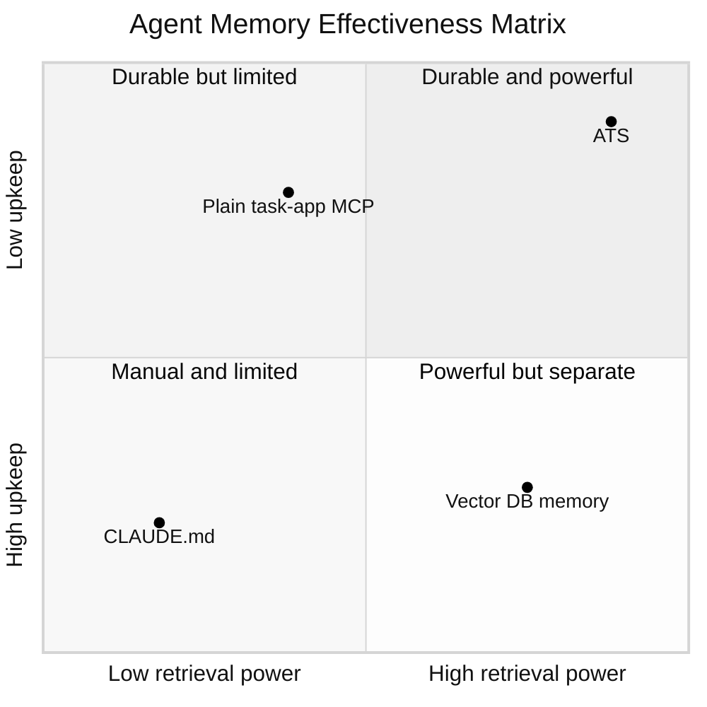
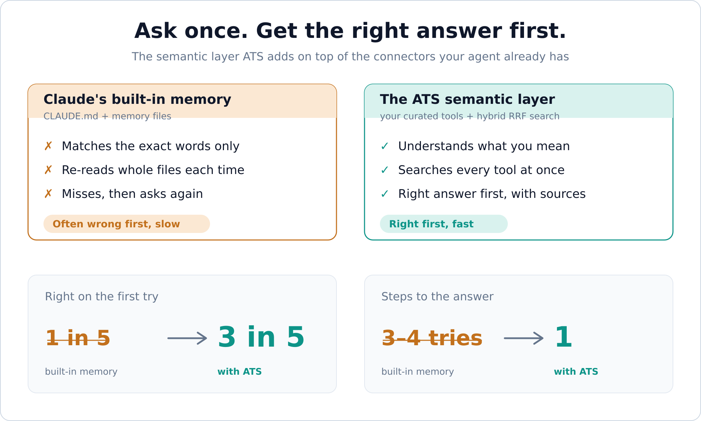
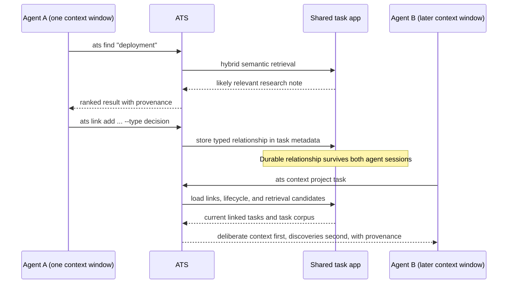
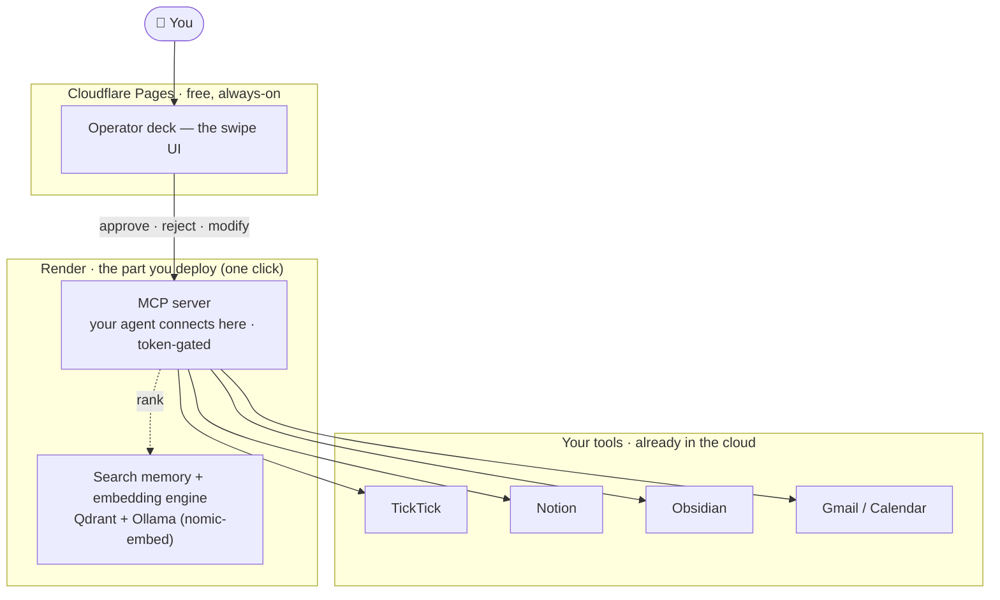

<p align="center">
  
</p>

<p align="center"><strong>Your task manager is the best agent memory you're not using.</strong></p>

<p align="center">
  <a href="https://www.npmjs.com/package/@reneza/ats-cli"></a>
  <a href="https://github.com/renezander030/agentic-task-system/actions/workflows/ci.yml"></a>
  <a href="LICENSE"></a>
  
</p>

`ats` is an **MCP server and CLI that gives your AI agent memory and execution context from the task system you already use** — TickTick, Taskmaster, Beads, or an Obsidian vault. It combines adapter-aware retrieval fused by Reciprocal Rank Fusion (RRF) with portable intent, exploration-to-execution promotion, goal hierarchy, typed task relationships, lifecycle validity, scoped access decisions, context assembly, an action ledger, and bounded task-state events. TickTick can add dense search through local Qdrant + Ollama; file and repository adapters work without either service. ATS works with Claude Code, Claude Desktop, Cursor, and any MCP client.

<p align="center">
  
  <br><em>The <a href="examples/operator-deck/">operator deck</a>: the agent proposes the next best action across your tools — you approve, reject, or send it back, with a thumb.</em>
</p>



Most "agent memory" projects build a *new* store — a vector DB, a bespoke
framework — that drifts from reality the moment you stop feeding it. But you
already maintain a knowledge base by hand, every day: your task app. Years of
curated, prioritized, deduplicated context, pre-filtered by the most reliable
ranker there is — you.

ATS makes that context agent-native. **Adapter, not migration**: keep the system
you already live in — TickTick, Taskmaster, Beads, Obsidian, Notion, GitHub, Airtable,
Google, or all of them at once via the [composite adapter](packages/adapter-composite/) —
and give your agent a fast, structured, two-way channel into it.

**ATS is task-first.** It turns the task manager you run your work from into the agent's
memory, with supporting systems (GitHub issues, Notion specs, docs) fused in as context
behind each task. It is **not** a second-brain / PKM tool — the task is the spine; the
supporting docs are there to serve it.

```bash
npm install -g @reneza/ats-cli @reneza/ats-adapter-ticktick
ats config use ticktick
ats auth login
ats find "deployment runbook"
```

<p align="center">
  
</p>

<p align="center">
  
  <br><em>One <code>ats find</code> across <strong>GitHub + Notion + TickTick</strong> via the <a href="packages/adapter-composite/">composite adapter</a>, ranked by RRF. Your connectors give the agent access; this is the semantic layer that lands the first query on the right answer.</em>
</p>

<p align="center">
  
  <br><em>ATS is <strong>task-first</strong>: your task manager is the agent's memory, with supporting tools (GitHub, Notion, docs) fused in as context — not a pile of <code>MEMORY.md</code> files the agent writes and forgets.</em>
</p>

## Why this exists

Andrej Karpathy's [LLM Wiki](https://www.mindstudio.ai/blog/andrej-karpathy-llm-wiki-knowledge-base-claude-code) idea — keep notes as plain markdown an LLM can reason over — is right about the destination and wrong about the starting line. Almost nobody's knowledge lives in clean markdown; it lives in the task app they've used for years. ATS closes that gap with pluggable storage adapters, so you get an agent-queryable knowledge layer without re-homing a single note.

## How it compares

| Approach | Where memory lives | Upkeep | Retrieval |
| --- | --- | --- | --- |
| `CLAUDE.md` / memory files | markdown you re-edit by hand | manual, drifts | none — whole file injected every session |
| Vector-DB agent memory (mem0-style) | a new store only the agent sees | rots unless you keep feeding it | dense-only |
| Plain TickTick / Obsidian MCP servers | your task app | none | keyword or the app's native search |
| **ATS** | your task app | none — you already curate it daily | hybrid retrieval plus typed context, validity, provenance, and audit |

## What changes when you wire it up

Six shifts, in the order they surprised me in real use:

**1. The task app becomes a two-way bus between you and your agent.**
It's not just somewhere the agent *reads* — it's where you and the agent hand work back and forth. Drop a task and the agent can read its title, body, tags, dates, checklist data, and any attachment metadata exposed by the adapter; the agent writes results back where you'll actually see them. ATS does not claim to download attachment file contents automatically.

**2. Semantic retrieval makes the *first* fetch the right one.**
Parallel hybrid retrieval (dense + sparse + keyword, fused with RRF, with provenance) instead of keyword grep. In practice this collapsed the usual "search → refine → search again" loop into a single fetch that comes back both faster and richer. Better context on turn one means better answers on turn one.

**3. Independent agents can follow durable, typed task relationships.**
Semantic search answers *"what looks relevant to this query?"* Typed links answer a different question: *"what was explicitly connected, why, and what context must the next agent follow?"* One agent can attach a `decision`, `evidence`, `depends-on`, `output`, or `supersedes` relationship. A later agent, in a separate context window, uses `ats context` to receive those deliberate links before retrieval discoveries. The handoff survives because it lives in the shared task app, not in either agent's chat history.



This adds structure *after* semantic search: retrieval proposes candidates; links preserve deliberate relationships, dependencies, and handoffs so another agent can reproduce the context later. ATS provides the shared read/write/link layer; agents remain independent and do not need direct agent-to-agent coordination.

**4. Agents receive execution intent, current validity, and an audit trail.**
`ats intent` captures the desired outcome, why it matters, completion conditions, authority, constraints, and approval boundary. `ats lifecycle` prevents archived, expired, future, or superseded context from silently steering current work. `ats security` marks content trust, scopes actions and resources, checks approvals, requires a reason, and audits allow/deny decisions. `ats ledger` records what an agent did, which sources and approvals it used, its output, and whether the task advanced.

`ats promote` turns exploratory material into a committed goal, project, or task without copying the source body. `ats hierarchy evaluate` follows explicit parent relationships and reports whether local work still supports its parent objective, including invalid role ordering, missing outcomes, cycles, stale ancestors, and active `conflicts-with` commitments.

ATS security is a decision point for cooperating clients, not an operating-system sandbox: it cannot intercept unrelated shell, filesystem, or network tools.

The metadata lives in plain YAML frontmatter at the top of the normal task body — intent, lifecycle, security, and hierarchy — with typed relationships in a `## Related` section and consulted resources (URLs and reference notes) in a `## References` section below. Writes are add-only: ATS never drops a row a human added or a link whose target later completed, so the same model works through every six-method adapter without ever clobbering your own edits. [`npm run prove:intent`](examples/intent-layer/) runs a deterministic synthetic proof of the complete path.


*A real task in TickTick: ATS keeps the flat frontmatter, the `## Related` graph (a bare up-link / Map-of-Content pointer, plus typed `supports` / `depends-on` relations), and `## References` in sync — leaving your own notes untouched.*

**5. Agents can react to state changes without becoming open-ended autonomous runners.**
`ats events snapshot` establishes a local baseline; `ats events watch --json` emits deterministic `task.created`, `task.updated`, `task.completed`, `task.removed`, `task.unblocked`, `task.validity.changed`, and `task.due.soon` envelopes as newline-delimited JSON. Before advancing the checkpoint, ATS atomically stages those content-free envelopes in a mode-`0600` local spool. `ats events pending` recovers unacknowledged observations after a consumer or output failure; `ats events ack` removes them only after explicit consumer acknowledgement. Stable event IDs deduplicate retries.

ATS only emits observations. A separate agent may consume them, but it must still evaluate task intent, validity, authority, and scoped security before acting.

**6. Context gets curated at *write* time, not just read time.**
The half everyone skips. Every item is hung on a "trunk" — a theme you already care about (`writing`, `client-work`, `side-project`) — the moment it's captured, so retrieval has structure to grab instead of a flat pile.

_Plus the plumbing that makes it usable every turn: a disk-backed corpus cache that avoids repeated store fetches, a retrieval benchmark, and a workflow-progress benchmark. ATS can now measure whether context was relevant and whether work advanced instead of treating a polished response as success. End-to-end latency depends on corpus size and enabled retrievers._

## Human-in-the-loop: the operator deck

The agent proposes the next best action across your tools; you approve, reject, or send it back to refine — with a thumb (the demo up top). The [operator deck](examples/operator-deck/) is a mobile card surface that derives suggestions from live ATS state and across adapters — *link this Notion spec to its TickTick task*, *archive this stale spike* — running the real action on approve (`relateTask`, `setTaskLifecycle`). Swipe right to approve, left to reject, **up to modify** (hands it back to the agent; it returns later). Suggestions are generated on demand from the current corpus, so the deck is always current; when nothing is pending it shows **All caught up**.

## Deploy it yourself

ATS is two pieces, and each has an easy home — only the backend is yours to run.



- **The operator deck (the app on your phone)** lives on **Cloudflare Pages** — free, always on, nothing to manage.
- **The backend you deploy** runs on **Render**. One click gives you the whole thing: the **MCP server** your agent connects to, plus its own **search memory** (Qdrant) and **embedding engine** (Ollama) so it can find tasks by meaning, not just keywords.
- **Your task systems** (TickTick, Notion, Obsidian, Gmail/Calendar) are already in the cloud — ATS just connects to them.

### Deploy the backend in one click

No terminal needed:

1. Click the button. It opens **Render** (a hosting service). Sign in with GitHub.
2. Render reads the blueprint in this repo and builds **four pieces** for you: the MCP server (the door your agent knocks on), a search memory, an embedding engine, and the operator-deck backend. The search memory and embedding engine are kept **private** — only your own server can reach them.
3. In a few minutes the MCP server is live at a URL like `https://ats-mcp.onrender.com`. Its tasks-by-meaning search works out of the box; you only add your own task-system token when you want it reading *your* tasks.
4. **Connect your agent — safely.** Open the **ats-mcp** service's **Environment** tab in Render and copy the auto-generated **`ATS_MCP_TOKEN`**. That token is the lock on the door: every request must carry it. Point your MCP client at `https://<your-mcp-url>/mcp` and have it send the header `Authorization: Bearer <ATS_MCP_TOKEN>`. No token, no access.
5. **Wire your own tasks (optional).** In the same tab, paste your task-system token into `TICKTICK_ACCESS_TOKEN`. The server restarts and now reads your real tasks.

[](https://render.com/deploy?repo=https://github.com/renezander030/agentic-task-system)

> This stack runs on Render's paid instances (the search memory and embedding engine each need a little always-on RAM and a small disk), so it stays awake and answers instantly — no cold-start wait. Prefer to run it on your own machine or a VPS instead? The same pieces are plain Docker containers; see [the deploy guide](deploy/README.md).

## Architecture

```
agentic-task-system/
├── packages/
│   ├── core/                       # adapter-agnostic
│   │   ├── retrieval.js            # find, hybrid, RRF
│   │   ├── task-context.js          # intent, lifecycle, typed graph/context
│   │   ├── action-ledger.js         # append-only agent action audit
│   │   ├── task-events.js           # deterministic corpus-diff events
│   │   ├── progress-benchmark.js     # workflow outcome scoring
│   │   ├── corpus-cache.js
│   │   ├── usage-log.js
│   │   ├── bench/                  # harness
│   │   └── adapter-interface.md
│   ├── adapter-ticktick/           # reference adapter (today)
│   ├── adapter-obsidian/           # local markdown vault (shipped v0.4)
│   ├── adapter-okf/                # Open Knowledge Format markdown bundles
│   ├── adapter-taskmaster/          # local tagged tasks.json + native dependencies
│   ├── adapter-beads/               # official bd JSON CLI + native dependency graph
│   ├── adapter-airtable/           # Airtable bases over the REST API (table = project, record = task)
│   ├── adapter-google/             # Google Sheets/Docs/Slides as a read-only corpus
│   ├── adapter-notion/             # Notion databases + pages (page body as markdown)
│   ├── adapter-github/             # GitHub issues + discussions as text records
│   ├── adapter-composite/          # cross-source: query many backends as one fused corpus
│   ├── cli/                        # `ats` command
│   └── mcp/                        # `@reneza/ats-mcp` — MCP server
├── docs/
│   ├── adapter-interface.md
│   ├── agent-layer.md
│   ├── wiki-conventions.md
│   └── retrieval.md
└── examples/
    ├── beads/                      # synthetic Beads adapter proof
    └── ticktick/                   # sanitized cron examples
```

## Adapter interface (the contract)

Six methods. Implement them, you have an adapter:

```ts
interface KnowledgeAdapter {
  listProjects(): Promise<Project[]>
  listTasksInProject(projectId: string): Promise<Task[]>
  getTask(projectId: string, taskId: string): Promise<Task>
  createTask(input: TaskInput): Promise<Task>
  updateTask(projectId: string, taskId: string, patch: TaskPatch): Promise<Task>
  urlFor(ref: { projectId: string, taskId: string }): string
}
```

Optional methods (Core uses if present, falls back to its own logic if not):

```ts
interface KnowledgeAdapter {
  searchByQuery?(query: string): Promise<Task[]>     // adapter's native search
  bulkFetch?(): Promise<Task[]>                       // single-call corpus refresh
  embeddings?(texts: string[]): Promise<number[][]>  // adapter-supplied embeddings
}
```

Without `embeddings()`, Core still provides ranked keyword retrieval and an optional native-search branch. With it, Core also provides dense+sparse hybrid retrieval and generic similarity search.

Full spec: [`docs/adapter-interface.md`](docs/adapter-interface.md).

## Available adapters

**You already have connectors. ATS is the semantic layer they're missing.**
Every vendor ships an official MCP connector now, so your agent can already *reach*
Notion, GitHub, and your task app. What it can't do is *retrieve* — answer "what do
I know about the auth migration?" ranked by relevance, across all of them. That's
the layer ATS adds:

- **Ranked by meaning, not endpoints.** Hybrid keyword + dense + sparse retrieval,
  fused with RRF, so the first result is the relevant one — not whatever the model
  guessed to query.
- **One query, every source.** The [composite adapter](packages/adapter-composite/)
  fuses GitHub + Notion + your task app into one ranked, deduped list, each hit
  tagged with its backend — the cross-source retrieval no single-vendor connector does.
- **Top-k, not token dumps.** Core runs the hybrid keyword+dense retrieval and
  hands back only what's relevant, so the agent never loads a whole base into
  context or hand-writes `filterByFormula` / Sheets ranges it tends to get wrong.
- **One contract, every backend.** Auth, pagination, rate limits, and payload
  shape collapse into the same six-method `Task`/`Project` vocabulary — add a
  backend and nothing in your prompts changes. Caching, the MCP surface, and
  deep links come for free.
- **The credential stays in the adapter.** A scoped Airtable PAT or a dedicated
  read-only Google user is the security boundary, instead of handing broad API
  access to the model's tool layer.

It's memory/retrieval infrastructure, not an API wrapper. For a single live
transactional write to one backend, call the API directly — the adapter earns its
keep the moment you want that data to be **persistent, searchable context fused
with everything else.**

| Adapter         | Status            | Storage                         |
| --------------- | ----------------- | ------------------------------- |
| `ticktick`      | shipped v0.1 (reference) | TickTick OpenAPI v1 + qdrant + ollama (nomic-embed) |
| `obsidian`      | shipped v0.4      | local markdown vault (files on disk) |
| `okf`           | shipped v0.6      | Open Knowledge Format markdown bundle |
| `taskmaster`    | shipped v0.6      | local `.taskmaster/tasks/tasks.json` |
| `beads`         | shipped v0.6      | repository-local Beads through `bd --json` |
| `airtable`      | shipped v0.8      | Airtable REST API (table = project, record = task) |
| `google`        | shipped v0.8      | Google Sheets / Docs / Slides (read-only corpus) |
| `notion`        | shipped v0.8      | Notion databases + pages (page body as markdown) |
| `github`        | shipped v0.8      | GitHub issues + discussions (repo = project, issue = task) |
| `composite`     | shipped v0.8      | many adapters fused as one cross-source corpus |
| `things`        | wishlist          | Things URL scheme + AppleScript |
| `apple-notes`   | wishlist          | AppleScript                     |
| `google-tasks`  | wishlist          | Google Tasks API                |

PRs welcome. Scaffold one in seconds and verify it against the contract:

```bash
ats adapter new linear              # writes ats-adapter-linear/ (six stubs + package.json)
# …implement the six methods…
ats adapter test ./ats-adapter-linear   # pass/fail/skip per contract check
```

### Composite: every backend as one cross-source corpus

The [composite adapter](packages/adapter-composite/README.md) is the cross-source layer —
it's what the demo above runs. Point it at several child adapters and one `ats find` fuses
GitHub + Notion + your task app into a single RRF-ranked list, each hit tagged with its
backend. Connectors give your agent access to one tool each; this is the retrieval layer
that searches all of them at once. Each child keeps its own auth; the composite holds none.

```bash
npm install -g @reneza/ats-cli @reneza/ats-adapter-composite \
  @reneza/ats-adapter-github @reneza/ats-adapter-notion @reneza/ats-adapter-ticktick
ats config use @reneza/ats-adapter-composite
ats find "auth token migration"   # one ranked list across every backend
```

**Per-adapter setup — auth, mapping, error strings — lives in each package's own README**
(linked from the table above): [Notion](packages/adapter-notion/README.md) ·
[GitHub](packages/adapter-github/README.md) · [Airtable](packages/adapter-airtable/README.md) ·
[Google](packages/adapter-google/README.md) · [Obsidian](packages/adapter-obsidian/README.md) ·
[OKF](packages/adapter-okf/README.md) · [Taskmaster](packages/adapter-taskmaster/README.md) ·
[Beads](packages/adapter-beads/README.md) · [TickTick](packages/adapter-ticktick/README.md).

The scaffold + conformance kit + interface doc make it a couple-hundred-line job for most well-behaved APIs.

## CLI surface

```bash
# Lifecycle
ats init <adapter>                 # select adapter + run a health check
ats config use <adapter>           # switch active adapter
ats auth login                     # delegates to adapter
ats doctor                         # adapter, auth, capabilities, cache, retrieval

# Adapters
ats adapter new <name>             # scaffold a starter adapter package
ats adapter test [target]          # run the conformance kit (pass/fail/skip)

# Retrieval
ats find <query>                   # parallel + RRF + provenance — DEFAULT
ats find <query> --explain         # ...and show each result's per-branch rank + RRF math
ats open <id-or-title>             # jump straight to it in your task app (deep link)
ats get <id-or-title> [--extract raw|json|yaml]
ats url <id-or-title>              # paste-ready cross-reference link
ats links <project> <task>         # resolve all deep-links inside a task body
ats hybrid <query>                 # dense+sparse RRF when embeddings are available
ats similar <id>                   # similarity when embeddings are available

# Any read command takes --json (alias for --format json) for piping to jq / agents:
ats find "deploy" --json | jq '.tasks[].title'

# Authoring
ats create "<title>" [--content "..."] [--project <id>] [--relevance]
ats update <project> <task> [--content "..."] [--title "..."]

# Agent execution context (portable across adapters)
ats intent set <project> <task> --outcome "..." --done-when "a,b"
ats promote <source-project> <source-task> <target-project> --outcome "..." --done-when "a,b"
ats hierarchy set <project> <task> --kind task --parent-project <project> --parent-task <task>
ats hierarchy evaluate <project> <task>
ats lifecycle set <project> <task> --status active --valid-until 2026-12-31
ats link add <src-project> <src-task> <dst-project> <dst-task> --type decision
ats link remove <src-project> <src-task> <dst-project> <dst-task> --type decision
ats graph <project> <task> --depth 2
ats context <project> <task> --limit 8
ats ledger record <project> <task> --action release.verified --advanced true
ats security set <project> <task> --trust untrusted --allow-actions read,write --allow-resources "repo://sample/*"
ats security check <project> <task> --action write --resource repo://sample/CHANGELOG.md --reason "Record approved result" --approvals owner
ats events snapshot                 # establish a local content-free checkpoint
ats events watch --json             # emit NDJSON observations; never launch agents
ats events pending --json           # recover every unacknowledged event
ats events ack <event-id>            # remove only after successful consumption

# Ops
ats bench run                      # run all retrievers against bench/data/questions.jsonl
ats bench score                    # markdown report of hit@1 / recall@5 / MRR
ats bench progress                 # advancement, context waste, blockers, criteria, reopen/corrections
ats bench analyze-usage            # per-tool stats from ~/.config/ats/search-log.jsonl
npm run prove:intent               # deterministic synthetic execution-context proof
npm run prove:taskmaster           # repo-local Taskmaster adapter proof
npm run prove:beads                # repo-local Beads adapter proof
npm run prove:progress             # deterministic synthetic workflow-outcome proof
```

## Use it from Claude Code, Claude Desktop, Cursor (MCP)

[`@reneza/ats-mcp`](packages/mcp) exposes the active adapter to any MCP client
as a tool set spanning retrieval, CRUD, and execution context: `find`,
`get_task`, `list_projects`, `create_task`, `update_task`, `similar`, `url_for`,
`set_task_intent`, `promote_exploration`, `get_task_hierarchy`,
`set_task_hierarchy`, `evaluate_task_hierarchy`, `set_task_lifecycle`, `get_task_security`, `set_task_security`,
`check_task_access`, `add_task_link`, `remove_task_link`, `task_graph`,
`context_for_task`, `record_action`, `list_actions`, `snapshot_task_events`,
`poll_task_events`, `list_pending_task_events`, and `acknowledge_task_events`.

For Claude Code this works as persistent memory between sessions without
introducing a new database: the agent recalls runbooks, decisions, and project
state from the task app you already keep current, instead of starting from zero
after every session or compaction.

```bash
# Claude Code
claude mcp add ats -e ATS_ADAPTER=@reneza/ats-adapter-ticktick -- ats-mcp
```

```jsonc
// Claude Desktop / Cursor config
{
  "mcpServers": {
    "ats": { "command": "ats-mcp", "env": { "ATS_ADAPTER": "@reneza/ats-adapter-ticktick" } }
  }
}
```

## Quickstart with the TickTick adapter

Already installed from the snippet at the top? Pick up at the OAuth step:

```bash
# Interactive — sets up TickTick OAuth + creates ~/.config/ats/config.json
ats config use ticktick
ats auth login          # prints the OAuth URL and next command

# (optional) For semantic / hybrid retrieval, run a local qdrant + ollama:
docker run -d --name qdrant -p 6333:6333 qdrant/qdrant
docker run -d --name ollama -p 11434:11434 ollama/ollama
docker exec ollama ollama pull nomic-embed-text
ats sync vector

# Try it
ats find "ffmpeg commands"
```

The local-first TickTick cache adapter refreshes its centralized JSON directly
through TickTick OpenAPI. `ats cache sync` preserves Inbox addressing and the
last good file on any project failure; it does not invoke a legacy TickTick CLI
or MCP server.

## Conventions

- **Pick a wiki project.** A designated project (default: `Permanent Notes`) holds your durable knowledge. Other projects hold ephemeral tasks.
- **Agent-data notes** = a regular note whose body has a fenced ```json or ```yaml block. Cron scripts and agents extract it via `ats get <title> --extract json`.
- **Cross-references** = adapter-native deep-link markdown form. Generate with `ats url <title>` (don't hand-write).
- See [`docs/wiki-conventions.md`](docs/wiki-conventions.md) for the full pattern.

## State integrity (the design rule)

Agent systems fail when the harness silently re-renders state between turns. ATS is a memory layer, so it holds the line: **writes round-trip without lossy re-encoding, the store → `Task` mapping is contract-tested (not a black box), and every retrieval result carries its provenance** (`sources`, `find --explain`). The same rule guards the outbound boundary — a publish-safety gate ([`scripts/check-no-pii.mjs`](scripts/check-no-pii.mjs)) fails the build if personal data could leak into a package. Full note: [`docs/state-integrity.md`](docs/state-integrity.md).

## Versioning

This is `v0.6` — portable execution intent, exploration promotion, goal hierarchy and conflict evaluation, durable bounded task events, workflow-progress evaluation, and shipped Taskmaster and Beads adapters. See [`CHANGELOG.md`](CHANGELOG.md).

## Star history

If ATS is useful to you, consider giving it a star — it helps others find it.

[](https://star-history.com/#renezander030/agentic-task-system&Date)

## License

MIT
