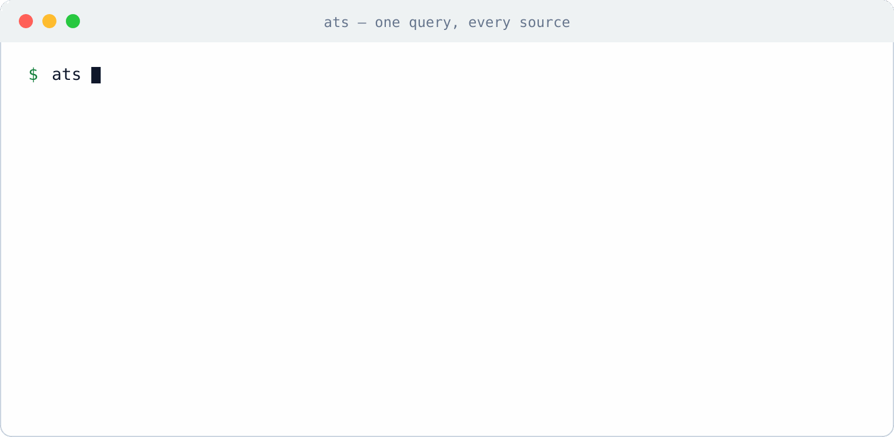

<p align="center">
  
</p>

<p align="center"><strong>Your task manager is the best agent memory you're not using.</strong></p>

<p align="center">
  <a href="https://www.npmjs.com/package/@reneza/ats-cli"></a>
  <a href="https://github.com/renezander030/agentic-task-system/actions/workflows/ci.yml"></a>
  <a href="LICENSE"></a>
  
</p>

`ats` is an **MCP server and CLI that keeps AI-agent context in the task systems you already maintain** — TickTick, Taskmaster, Beads, Obsidian, Notion, GitHub, Airtable, Google, or several at once through the [composite adapter](packages/adapter-composite/). It retrieves relevant tasks, notes, decisions, and runbooks with provenance, then can write results back when the active adapter supports writes. Works with Claude Code, Claude Desktop, Cursor, and any MCP client.

**Adapter, not migration.** Your task app, repository, or vault remains authoritative. ATS maps that source into a common task contract; optional caches and vector indexes improve retrieval but never become a second record that people must edit. It is **task-first**: the task is the spine, while supporting material such as GitHub issues and Notion specs is retrieved as context behind it.

**Two layers, one CLI: tasks and a knowledge graph.** The task layer is record-based on purpose — every entry lives in one backend's projects and fields, and that backend stays authoritative. A record-based layer structurally cannot hold the other thing agents accumulate: durable knowledge **written from any source, about mixed subjects, into one space**. The knowledge-graph layer — **`ats kg`** (kg = knowledge graph) — is ATS's answer to exactly that: subject–predicate–object facts with provenance and temporal validity, proposed by agents from anywhere (a call, a task, a repo, a chat), ratified by a human, and queried in one place no matter which backend the surrounding work lives in. The built-in store is embedded and dependency-free. For a dedicated graph engine, the recommended pairing is **[Graphiti](https://github.com/getzep/graphiti) as the graph database server** and **[LadybugDB](https://github.com/LadybugDB) as the embedded graph database**: `ats kg export --cypher` emits a LadybugDB-loadable script, and `ats kg export` (JSON, full provenance) is ready for a Graphiti ingest pipeline.

```bash
npm install -g @reneza/ats-cli @reneza/ats-adapter-ticktick
ats config use ticktick
ats auth login
ats find "deployment runbook"
```

<p align="center">
  
  <br><em>One <code>ats find</code> across <strong>GitHub + Notion + TickTick</strong>. ATS ranks the available retrieval branches with RRF and retains result provenance.</em>
</p>

## Architecture and trust boundaries

ATS separates the authoritative record from the retrieval machinery around it:

```text
AI client or operator
        |
        | local stdio, or token-gated HTTP when self-hosted
        v
ATS CLI / MCP server
        |
        +-- Core: task contract, links, lifecycle, ledger, events
        +-- Retrieval: keyword + native + optional dense branches -> RRF
        |
        v
Adapter boundary (auth, mapping, reads, patch-style writes)
        |
        +-- TickTick / Notion / GitHub / Airtable / Google
        +-- Obsidian / Taskmaster / Beads / OKF files
        |
        +-- derived retrieval state
            corpus cache + optional Qdrant/Ollama index
```

- **The backend remains authoritative.** ATS does not ask users to edit a duplicate memory database. Writes go through the active adapter, which owns backend-specific authentication, field mapping, and deep links.
- **Retrieval state is derived, not canonical.** Core keeps a five-minute corpus cache by default. Dense retrieval is optional: adapters can provide embeddings, and the TickTick reference adapter can use Qdrant plus Ollama. Without vectors, keyword and adapter-native branches still run.
- **Credentials stay at the adapter boundary.** A composite adapter delegates authentication to each child and stores no additional cross-source credential. Its children still execute inside one ATS process; this is routing separation, not process isolation. Local stdio does not expose an MCP port. The hosted blueprint adds a bearer-token gateway, private Qdrant/Ollama services, and a separate public demo backend for the optional operator deck.
- **Core reports the failures it can see.** Retrieval branches and top-level composite corpus failures return `degraded` and `warnings`. Known omission paths inside adapter fallbacks are called out under [Tradeoffs and limits](#tradeoffs-and-limits).
- **State changes are traceable.** Results carry source provenance; `find --explain` exposes RRF contributions; writes use patch semantics, and supported writes can retain before-images for undo.

The corpus cache can contain full task records; the query log contains search text; the action ledger can contain write before-images; and Qdrant payloads can contain task text and metadata in addition to embeddings. ATS does not apply application-level encryption or runtime redaction to these copies. Scope host access, backups, retention, and deployment to the sensitivity of the underlying task systems. See [retrieval](docs/retrieval.md), [state integrity](docs/state-integrity.md), and the [deployment guide](deploy/README.md) for the exact behavior.

### Deployment choices

| Mode | Retrieval | Trust and operations boundary |
| --- | --- | --- |
| **Local stdio** | Keyword/native retrieval by default; dense retrieval only when the adapter provides it | The MCP endpoint is not network-exposed. Adapter calls may still reach their source systems; credentials and cache files stay on the machine running ATS. |
| **Composite adapter** | One combined child corpus; Core ranks keyword and unioned native-search branches, with RRF across those available branches. The composite does not currently expose child vector search. | Each child owns its auth and mapping but runs in the same ATS process. A top-level child corpus failure is reported as degraded; see the known fallback gaps below. |
| **Hosted blueprint** | Keyword/native retrieval plus private Qdrant/Ollama services | A bearer-token MCP gateway and separate optional operator-deck backend are public; Qdrant and Ollama stay on the private service network. Qdrant/Ollama have disks, while `ats-mcp` runtime files are ephemeral by default. You operate token rotation, persistence, backups, availability, and hosting cost. |

**“No migration” means no second source of truth. It does not mean zero derived storage.**

## How it compares

| Approach | Authoritative record | Additional state | Retrieval |
| --- | --- | --- | --- |
| `CLAUDE.md` / memory files | Markdown maintained for the agent | The files themselves | Whole-file or harness-specific lookup |
| Separate memory service | Agent-specific database | A corpus and ingestion path to maintain | Product-specific |
| Plain backend connector | Source task app, repository, or vault | Usually none beyond connector state | Direct fetch or backend-native search |
| **ATS** | Source task app, repository, or vault | Cache, query/action/event state; optional derived vector index | Keyword + native + optional dense retrieval, RRF, provenance, typed context |

ATS is a good fit when operational context already lives in task systems or connected work tools and agents need ranked, traceable retrieval across them. If clean Markdown is already the complete source of truth and whole-file loading stays small, a file-native workflow may be simpler.

## What you get

- **A two-way bus.** The agent reads the task fields an adapter provides; where the adapter supports writes, it writes results back where you'll see them.
- **First-fetch relevance.** Capability-driven branches — keyword and adapter-native search, plus dense retrieval when available — are RRF-fused with provenance to reduce repeated search-and-refine loops.
- **Durable typed links.** One agent attaches a `decision` / `depends-on` / `output` / `supersedes` link; a later agent in a fresh context receives it via `ats context`. The handoff lives in the task app, not a chat log.
- **Execution context.** `ats intent` captures outcome/why/done-when; `ats lifecycle` keeps stale context from steering current work; `ats security` records scoped allow/deny decisions for cooperating clients; `ats ledger` records what an agent did and whether the task advanced; `ats promote` turns exploration into a committed goal; `ats hierarchy evaluate` checks local work still supports its parent.
- **Bounded events.** `ats events watch --json` emits deterministic `task.created/updated/completed/...` NDJSON, spooled `0600` with pending/ack recovery and stable dedup IDs. ATS only emits observations — a consumer still evaluates intent, validity, and security before acting.
- **Task graph for agents.** Tasks become structured nodes with proof, writeback, review, lifecycle, and link edges instead of free-form memory text; see [`docs/task-graph-for-agents.md`](docs/task-graph-for-agents.md).
- **A facts layer.** `ats kg` keeps durable subject–predicate–object knowledge beside the tasks: agents **propose**, a human **ratifies** (the only write path), and `ats kg ask` answers with deterministic lexical scoring plus full provenance — no LLM, no graph server, an append-only file that travels with `ats state export`. Retraction closes a fact's validity interval instead of deleting it, and `ats kg export --cypher` loads the graph into embedded engines (LadybugDB/Kùzu).
- **Session-index handoff.** Coding-agent session browsers can keep raw transcript analytics while ATS stores the durable task-linked summary; see [`docs/agent-session-index.md`](docs/agent-session-index.md).

ATS-managed execution metadata can be encoded in the task body, with typed links under `## Related` and consulted sources under `## References`. Managed helpers are designed to preserve human-authored rows and links, but a direct content update can replace the complete body; callers should read first, write the smallest intended change, and verify the result. [`npm run prove:intent`](examples/intent-layer/) runs a deterministic synthetic proof of the execution-context path.

## Minimal adapter-neutral workflow

1. **Select and verify an adapter:** `ats config use <adapter>`, authenticate as its README describes, then run `ats doctor`.
2. **Retrieve the working set:** `ats find "deployment runbook" --json` ranks the branches available from that adapter and retains provenance.
3. **Inspect the authoritative item and its context:** `ats context <project> <task>` uses the common adapter contract and does not require an adapter-specific notes layer.
4. **Attach durable execution context:** `ats intent set <project> <task> --outcome "..." --done-when "a,b"` and `ats link add <src-project> <src-task> <dst-project> <dst-task> --type depends-on`.
5. **Verify the assembled handoff:** rerun `ats context <project> <task>` to read back linked decisions, dependencies, proof, lifecycle state, and relevant retrieval results.
6. **Write through the adapter or source app, then read back.** Keep the authoritative backend current so the next agent receives durable state rather than a chat-only handoff.

## Deploy it yourself

The optional **operator deck** is a static phone-oriented web app deployable to **Cloudflare Pages**. The supplied **Render** blueprint builds the MCP gateway/server plus private Qdrant and Ollama services.

[](https://render.com/deploy?repo=https://github.com/renezander030/agentic-task-system)

After deploy, copy the auto-generated `ATS_MCP_TOKEN` from the **ats-mcp** service's Environment tab, point your MCP client at `https://<your-mcp-url>/mcp` with header `Authorization: Bearer <ATS_MCP_TOKEN>`, and set `TICKTICK_ACCESS_TOKEN` to read your real tasks. Prefer your own machine or a VPS? Same pieces as plain Docker containers — see [the deploy guide](deploy/README.md).

## Available adapters

Backend connectors let an agent reach Notion, GitHub, and task systems, but access alone does not provide one ranked answer to a question such as "what do I know about the auth migration?" ATS adds a common retrieval layer: the [composite adapter](packages/adapter-composite/) combines installed child corpora, namespaces their project IDs, unions supported native-search results, and lets Core rank the available branches with provenance. Each child reads its own credentials, but all configured children execute in the same ATS process.

| Adapter | Authoritative source | Retrieval or write notes |
| --- | --- | --- |
| `ticktick` | TickTick OpenAPI v1 | Keyword/native retrieval works without vectors; optional Qdrant + Ollama add dense retrieval. |
| `obsidian` | Local Markdown vault | File-native, patch-style writes preserve unknown frontmatter. |
| `okf` | Open Knowledge Format Markdown bundle | Local bundle. |
| `taskmaster` | Local `.taskmaster/tasks/tasks.json` | Repository-local task state. |
| `beads` | Repository-local Beads via `bd --json` | Dependency-aware local task state. |
| `airtable` | Airtable REST API (table = project) | Adapter-scoped API access. |
| `google` | Google Sheets / Docs / Slides | Read-only. |
| `notion` | Notion databases + pages | Integration-scoped access. |
| `github` | GitHub issues + discussions | Repository-scoped access. |
| `composite` | Installed child backends | Combines child corpora, namespaces project IDs, unions native-search hits, and routes writes; it is not an independent record store and does not currently expose child embeddings. |
| `things` / `apple-notes` / `google-tasks` | — | Wishlist, not implemented. |

Per-adapter auth and mapping live in each package's README. PRs welcome — scaffold and verify against the contract:

```bash
ats adapter new linear              # writes a contract-complete skeleton
ats adapter test ./ats-adapter-linear   # pass/fail/skip per contract check
```

## Tradeoffs and limits

- **Freshness is adapter-dependent.** Core's corpus cache has a five-minute default TTL. Backend sync behavior, pagination, and inclusion of completed work vary by adapter; ATS does not promise universal real-time reads. `ats cache sync` refreshes the cache on demand (cron-friendly) — incrementally when the adapter implements `bulkFetchDelta()`, as a full refetch otherwise.
- **Dense retrieval adds infrastructure.** Qdrant and Ollama can improve semantic recall, but they add indexing, persistence, resource, and backup work. Baseline `find` still returns keyword/native results when vectors are unavailable, although an attempted vector branch can make the response degraded; vector-only `hybrid` and `similar` operations still require that infrastructure.
- **The common contract is intentionally small.** The adapter interface defines six storage methods plus authentication lifecycle hooks, while practical write coverage, richer fields, and native search vary. Check the adapter README before assuming parity across backends.
- **Degraded results are still partial results.** ATS reports failed or timed-out Core branches, dropped corpus sources — including per-project failures inside a composite fallback fetch and TickTick project fetches — and native-search sources a backend could not read. The caller must still decide whether partial context is acceptable; `warnings` says what is missing, not whether it mattered.
- **Composite search is not semantic deduplication.** `ats dedup` is a separate analysis command. Fusion identity is namespaced per backend (`<backend>:<taskId>`), so identical raw ids from different backends stay distinct results; semantically duplicate tasks still appear separately until you link them.
- **The hosted blueprint is a reference deployment, not a managed service.** One bearer token grants the full MCP tool surface; the blueprint does not provide per-user or per-tool scopes, multi-tenant RBAC, high availability, or an SLA.
- **Hosted ATS runtime state is ephemeral by default.** The blueprint persists Qdrant and Ollama, but does not mount a disk for `ats-mcp`; its cache, query log, action ledger and undo before-images, event spool, and vector-sync metadata disappear on a restart or redeploy.
- **Events are observations, not authorization.** `ats events watch` can report task changes, but a consumer must still evaluate intent, validity, and security before taking an external action.
- **The facts layer is lexical and human-gated.** `ats kg ask` is deterministic keyword scoring with provenance, not semantic search, and nothing reaches the fact store without human ratification — a burst of agent proposals waits for review by design.
- **ATS policy is not a sandbox.** The CLI enforces the declared approval metadata — a write whose target sets `intent.approvalRequired` or lists the action in `security.approvalRequiredFor` stages into `ats review` instead of reaching the backend (`ATS_REVIEW_ALL=1` gates every write) — but this guards ATS's own write path only. `ats security check` remains an application-level decision point for cooperating clients, and nothing here intercepts shell, filesystem, network, model, or secret access outside ATS. A client calling an adapter directly bypasses the CLI gate.

## Verification and operational evidence

- [CI](https://github.com/renezander030/agentic-task-system/actions/workflows/ci.yml) runs the full repository gate on Node 20 and 22: lint, public-claim checks, PII checks, unit tests, adapter and intent proofs, and the progress benchmark.
- The [publish-safety gate](scripts/check-no-pii.mjs) scans both the repository surface and npm package tarballs for secrets, personal paths, configured personal-data patterns, and locally configured denylist terms. It protects publication surfaces. At runtime, the composite adapter can additionally enforce per-backend trust levels with configured redaction patterns — a write routed to a `"trust": "public"` child that matches a pattern is blocked, not silently stripped (see the composite README). That screen guards ATS's own composite write path; it is not general data-loss prevention.
- [State-integrity tests and conventions](docs/state-integrity.md) cover patch-style writes, preservation of unknown fields, explicit store-to-`Task` mapping, result provenance, and explainable RRF contributions.
- [Retrieval behavior](docs/retrieval.md) documents Core's branches, the corpus cache, time budgets, graceful branch failure, usage logging, and what affects latency.

These gates verify repository behavior; they are not a production availability or security certification.

## CLI surface

```bash
# Lifecycle
ats init [adapter]                  # select an adapter and run a health check
ats config use <adapter>            # switch the active adapter
ats auth login                      # delegate login to the active adapter
ats doctor                          # inspect adapter and service health

# Retrieval  (any read command takes --json for piping to jq / agents)
ats find <query> [--explain]       # parallel + RRF + provenance — DEFAULT
ats open <project> <task>          # open any adapter item by explicit ids
ats context <project> <task>       # task + valid linked/retrieved context
ats link list <project> <task>     # list portable typed links
ats hybrid <query>                 # dense+sparse retrieval when embeddings exist
ats similar <id>                   # related items when embeddings exist

# Notes-layer shortcuts (currently TickTick and Obsidian)
ats get <id-or-title> [--extract raw|json|yaml]
ats url <id-or-title>              # paste-ready note cross-reference
ats links <project> <task>         # resolve deep-links in a note body

# Authoring
ats create "<title>" [--content ..][--project <id>]
ats update <project> <task> [--content ..][--title ..]

# Agent execution context (portable across adapters)
ats intent set <project> <task> --outcome ".." --done-when "a,b"
ats promote <src-proj> <src-task> <target-proj> --outcome ".." --done-when "a,b"
ats hierarchy set <project> <task> --kind task
ats hierarchy evaluate <project> <task>
ats lifecycle set <project> <task> --status active --valid-until 2026-12-31
ats link add <src-proj> <src-task> <dst-proj> <dst-task> --type decision
ats graph <project> <task>
ats context <project> <task>

# Facts layer (proposed by agents, ratified by you)
ats kg propose "Acme GmbH" "prefers" "invoices as PDF" --domain sales --source "call 2026-08-01"
ats review approve <id> && ats kg ratify --all
ats kg ask "what does Acme prefer" --domain sales --json
ats kg export --cypher > facts.cypher      # load into LadybugDB / Kùzu
ats ledger record <project> <task> --action release.verified --advanced true
ats security set <project> <task> --trust trusted --allow-actions read --allow-resources task:self
ats security check <project> <task> --action read --resource task:self --reason "load context"
ats events watch --json            # NDJSON observations; never launches agents

# Ops
ats review list                 # writes staged by approvalRequired targets
ats review approve ID && ats review apply --all
ats cache sync                  # refresh the corpus cache (cron-friendly)
ats bench run
ats bench score
ats bench progress --json
ats bench analyze-usage --days 7
npm run prove:intent
npm run prove:taskmaster
npm run prove:beads
npm run prove:progress
```

## Use it from any MCP client (Claude Code, Claude Desktop, Cursor, Windsurf, OpenCode)

[`@reneza/ats-mcp`](packages/mcp) exposes the active adapter as a tool set spanning retrieval, CRUD, and execution context (`find`, `get_task`, `create_task`, `set_task_intent`, `add_task_link`, `resolve_task_links`, `context_for_task`, `record_action`, `undo_write`, `poll_task_events`, and more). For Claude Code this provides persistent context between sessions without replacing the task system as the source of truth; optional caches and vector indexes remain derived retrieval state.

ATS speaks MCP over **stdio**, so any client that can launch a stdio MCP server works. Only the config file and the wrapper key differ; the binary (`ats-mcp`) and its `ATS_ADAPTER` env are the same everywhere.

| Client | Where the config lives | Wrapper key |
| --- | --- | --- |
| Claude Code | `claude mcp add` (below) | n/a |
| Claude Desktop | `claude_desktop_config.json` | `mcpServers` |
| Cursor | `~/.cursor/mcp.json` | `mcpServers` |
| Windsurf | `~/.codeium/windsurf/mcp_config.json` | `mcpServers` |
| OpenCode | `opencode.json` | `mcp` (shape differs, below) |

```bash
# Claude Code
claude mcp add ats -e ATS_ADAPTER=@reneza/ats-adapter-ticktick -- ats-mcp
```

```jsonc
// Claude Desktop / Cursor / Windsurf — identical `mcpServers` shape
{
  "mcpServers": {
    "ats": { "command": "ats-mcp", "env": { "ATS_ADAPTER": "@reneza/ats-adapter-ticktick" } }
  }
}
```

```jsonc
// OpenCode (opencode.json) — local stdio server, note `command` is an array
{
  "mcp": {
    "ats": {
      "type": "local",
      "command": ["ats-mcp"],
      "environment": { "ATS_ADAPTER": "@reneza/ats-adapter-ticktick" },
      "enabled": true
    }
  }
}
```

Install the binary on `PATH` first (`npm i -g @reneza/ats-cli`), or use an absolute path to `ats-mcp` if your client does not inherit your shell `PATH`.

## Conventions

- **Wiki project.** A designated project (default `Permanent Notes`) holds durable knowledge; others hold ephemeral tasks.
- **Agent-data notes** = a note whose body has a fenced ```json / ```yaml block, extracted via `ats get <title> --extract json`.
- **Cross-references** = adapter-native deep links — generate with `ats url <title>`, don't hand-write.
- Full pattern: [`docs/wiki-conventions.md`](docs/wiki-conventions.md).

## State integrity

ATS tests managed metadata rewrites for preservation of human-authored fields, requires explicit store-to-`Task` mapping, and carries result provenance (`sources`, `find --explain`). Coverage and raw-update behavior remain adapter-specific. A publication-safety gate ([`check-no-pii.mjs`](scripts/check-no-pii.mjs)) fails the build when covered personal-data patterns appear in repository or package surfaces. Full note: [`docs/state-integrity.md`](docs/state-integrity.md).

For the agent-side operating model, see [`docs/task-graph-for-agents.md`](docs/task-graph-for-agents.md): task text is the human projection, but the execution layer needs structured links, proof commands, review requirements, and writeback targets.

## Working on ATS

Contributions welcome — bug fixes and especially new adapters under `packages/adapter-*`.
See [CONTRIBUTING.md](CONTRIBUTING.md) for the dev setup and adapter pattern, and
[AGENTS.md](AGENTS.md) if you drive a coding agent over the repo. Working on the source,
[`pi-codegraph`](https://github.com/renezander030/pi-codegraph) gives your agent a
call-graph of the monorepo — the adapter pattern and the blast radius of a core change —
so it stops re-reading the whole tree each session.

## Releases and license

**v0.10.0** added partial-retrieval reporting, optional reranking, usage observability, duplicate/contradiction detection, and reactive OAuth refresh. **v0.9.0** added reversible writes, forward/dangling links, Obsidian path hardening, and verified stdio configuration for more clients. Full history: [`CHANGELOG.md`](CHANGELOG.md).

MIT. See [LICENSE](LICENSE).

If ATS is useful, consider a ⭐ — it helps others find it.
