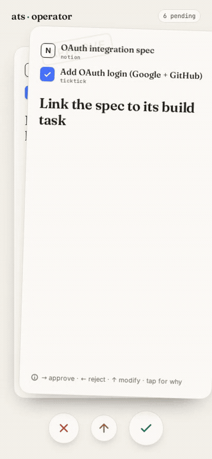

# Operator deck — human-in-the-loop approvals

A mobile-first card deck for reviewing the agent's suggested next actions on your
task system. Each card shows the referenced items with the **adapter they came
from** (the agent cycles adapters on its cadence wakeups and links across systems
with semantic search) and one **verb-led GTD action**. Swipe **right to approve**,
**left to reject**, **up to modify** (hands the card back to the agent to refine —
it returns to the stack later), or tap to flip it for the reasoning. Approving
performs the real ATS action; rejecting is remembered.



## How suggestions are generated

Suggestions are derived **on demand from live ATS state** — there is no background
job. Each time the deck loads (or you pull to refresh), `GET /api/suggestions`
re-scans the current corpus and rebuilds the ranked deck:

- **Relate** — two active tasks (or a task and a note) that clearly belong
  together but aren't linked yet → approving runs `relateTask`, which auto-routes
  (active task → `## Related`, note → `## References`).
- **Archive** — a task gone stale (long past due, no movement) → approving sets
  `lifecycle: archived` (reversible) so dead context stops steering current work.

Because it reads live state, the deck is always current: a link you just made is
never re-suggested, and a task that just went stale shows up next refresh. A
left-swipe is recorded in a small dismissed set so it never reappears.

## When there are no more actions

When the deck is exhausted — everything swiped, or the scan finds nothing
actionable — it shows the empty state:

> **All caught up** · _N active tasks scanned_

No cards, nothing pending. The next time state changes (you finish work, an agent
adds tasks), reopening the deck surfaces the new suggestions.

## Run it

```bash
# Real, wired to your task store (approve mutates real tasks):
node server.mjs                       # http://localhost:8094

# Safe to try — approve simulates, never mutates:
DECK_DRYRUN=1 node server.mjs

# Curated demo deck (the public/always-on surface + the GIF above):
DECK_DEMO=1 node server.mjs
```

Env: `PORT` / `OPERATOR_PORT` (8094; Render sets `PORT`), `OPERATOR_TOKEN`
(require `Authorization: Bearer` on writes), `OPERATOR_ORIGIN` (CORS allow-origin
for a separately hosted deck), `DECK_DEMO` / `DECK_DRYRUN`.

## Deploy

- **UI** → Cloudflare Pages (static `web/` + Pages Functions). Free, always on.
- **This backend** → any Node host. There's a one-click [Deploy to Render](../../render.yaml)
  blueprint (root `render.yaml`); it boots in `DECK_DEMO=1` so it runs with zero
  config. To wire your real tasks: set `DECK_DEMO=0` and authenticate the adapter
  (TickTick token via `~/.config/ats`, or your adapter's env). Keep `DECK_DRYRUN=1`
  while you trust it, then drop it to let approvals mutate real tasks.

## Files

- `suggest.mjs` — the suggestion engine (corpus → ranked cards) and executor.
- `server.mjs` — zero-dependency HTTP API + static host.
- `web/index.html` — the deck (React + framer-motion, no build step).
- `demo-data.mjs` — curated cards for the demo/always-on surface.
